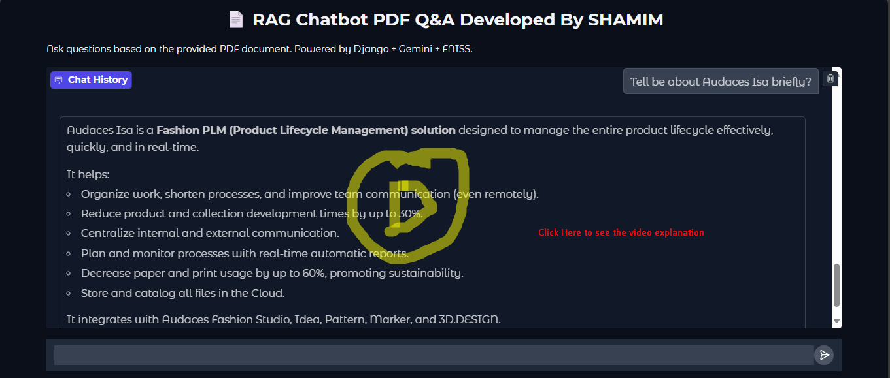
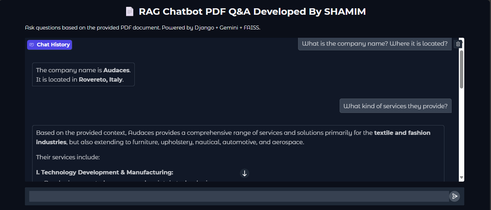
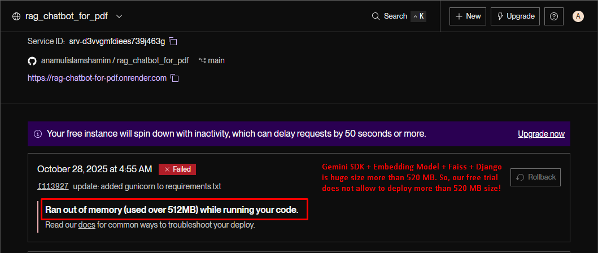
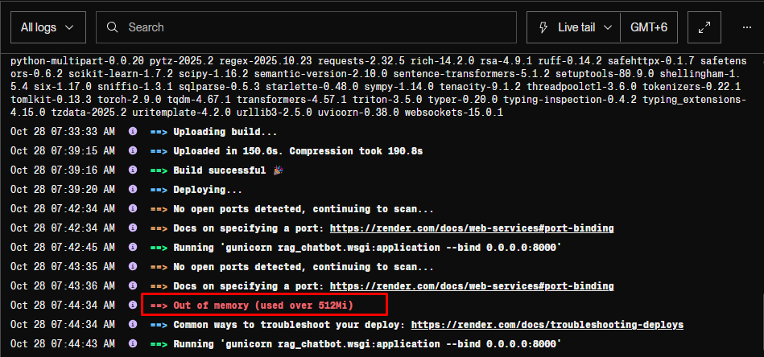

# 📺 Click Below Image To Watch Video Explanation
[](https://drive.google.com/file/d/1ZWc-QDKpjW40JsLfbdCFbIq_Wj6rXzSB/view)

# 📄 RAG Chatbot PDF Q&A

This project is a **Retrieval-Augmented Generation (RAG) chatbot** built with **Python, Django REST API, and Gradio UI**. It allows users to ask questions based on the content of a PDF document and receive AI-generated responses. The chatbot uses **Gemini (gemini-2.5-flash)** for generation, **all-MiniLM-L6-v2 embeddings** for semantic search, and **FAISS** for vector storage.

---

## 🚀 Features

- **PDF-based Q&A**: Ask questions derived from any uploaded PDF document.
- **AI-powered responses**: Uses Gemini LLM and embeddings to retrieve relevant answers.
- **REST API**: Access the chatbot programmatically via `/chat/`.
- **Gradio UI**: Interactive ChatGPT-like web interface for testing and demonstration.
- **Swagger Documentation**: API documentation is available for testing endpoints.
- **API Key Authentication**: Secure access to the API to prevent unauthorized use.
- **Rate Limiter**: 1 request per minute per API key to prevent abuse.
- **SQLite Database**: Lightweight relational database for testing (no chat history storage required).

---

## ⚙️ Technology Stack

- **LLM / AI**: Gemini (`gemini-2.5-flash`)
- **Embeddings**: `all-MiniLM-L6-v2`
- **Vector Database**: FAISS
- **PDF Processing**: PyPDF2, PyMuPDF
- **Web Framework**: Django REST Framework
- **UI**: Gradio
- **Database**: SQLite3 (simple, lightweight, relational)
- **API Authentication**: API key-based
- **Rate Limiting**: Custom per-key rate limiter

> SQLite was chosen over PostgreSQL/MySQL because this project is primarily for testing and demonstration purposes. It provides relational features without the overhead of a full database setup.

---

## 📥 Setup Instructions

1. **Clone the repository**
```bash
git clone https://github.com/anamulislamshamim/rag_chatbot_for_pdf.git
cd rag_chatbot_for_pdf
````

2. **Create a virtual environment and install dependencies**

```bash
python -m venv venv
source venv/bin/activate  # Linux/Mac
venv\Scripts\activate     # Windows

python -m pip install --upgrade pip

pip install -r requirements.txt
```

3. **Create `.env` file**

```env
DEBUG=False
SECRET_KEY="django-insecure-2$+1h)6yjj!w$g$e-$f=nt^7)j%(l+c=+y4in&g"
DATABASE_URL=sqlite:///db.sqlite3
API_KEY_GEMINI="AIzaSyB_DIaezI"
AUTH_API_KEY="SSQ9oDmBfWnK-BTuWmgnvk"
```

4. **Run migrations**

```bash
python manage.py migrate

python manage.py collectstatic
```

5. **Start Django server**

```bash
python manage.py runserver
```

6. **Run Gradio UI**

```bash
python gradio_app.py
```
7. **Visite Gradio UI**
* Visit: http://127.0.0.1:7860 

> By default, Gradio will provide a temporary public link for sharing. Use `share=True` to make it accessible globally.

---

## 🔑 API Key Setup

* All API requests require a valid `Authorization: Api-Key <your_api_key>` header.
* Example curl request:

```bash
curl -X POST http://127.0.0.1:8000/api/chat/ \
  -H "Authorization: Api-Key SSQ9oDmBfWnK-BTuWmgnvk" \
  -H "Content-Type: application/json" \
  -d '{"question": "What is the company name?"}'
```

* Requests without a valid API key will return:

```json
{"detail": "API key required"}
```

## How to generate Api-Key
```python
python manage.py create_apikey "test_api_key_2" --notes "This token is for demonstration purpose!"
```
```bash
Name: test_api_key_2
Plaintext API key (copy and store it now; only shown once):
mL0yv3LSvD7EDPgWfOhJjAZNWOGeVfldv17kIZIPvyI
````

---

## ⏱ Rate Limiter

* Each API key is allowed **1 request per 10 seconds**.
* Requests exceeding this limit will return 429 status code with the following:

```json
{"detail": "Rate limit exceeded. Try again in XXs."}
```

* Prevents abuse and ensures fair usage of your API key.

---

## 📝 Additional Notes

* **Gradio UI** provides a ChatGPT-like interface for testing the chatbot interactively.
* **Swagger UI** is available at `/swagger/` to explore and test API endpoints.
* SQLite3 is sufficient for this project since we do **not store chat history** — it’s lightweight and relational.

---

## 📄 Requirements

Example `requirements.txt` snippet:

```text
Django==5.2.7
djangorestframework==3.16.1
drf-yasg==1.21.11
faiss-cpu==1.12.0
google-ai-generativelanguage==0.6.15
gradio==5.49.1
requests==2.32.5
sentence-transformers==5.1.2
PyPDF2==3.0.1
PyMuPDF==1.26.5
sqlite3
python-dotenv==1.1.1
```

*(Full `requirements.txt` included in repository)*

---

## ❓Some Example Questions
```bash
1. What is Audaces?
2. Tell me about Audaces?
3. AUDACES EUROPE SRL contact information?
```

## 🙏 Thank You

Thank you for giving me this exciting project as an assignment. It allowed me to implement a full **RAG chatbot pipeline** with **PDF-based Q&A**, **AI/NLP integration**, **secure API access**, and an interactive **Gradio interface**.

— **Shamim** <br>
**[LinkedIn Profile](https://www.linkedin.com/in/anamul-islam-shamim/)**
```

```
## End Result Screenshot

```
```
## Render Deployment Issue
I am using render free trial. In free trial maximum project size allow 512 MB. But our project size is much more 
thatn 512 MB. Gemini SDK + Embedding Model + Faiss + numpy and internally Pytorch, Scikit-Learn, Tensorflow etc.


```